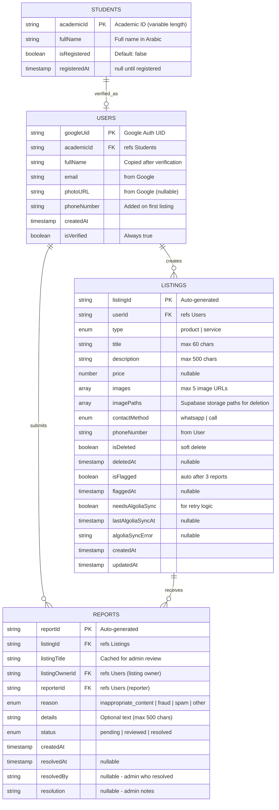

# UniVerse - Entity Relationship Diagram (ERD)

## Mermaid ERD



---

## Relationships

| From | To | Cardinality | Description |
|------|-----|-------------|-------------|
| Students | Users | 1:0..1 | كل طالب ممكن يسجل حساب واحد فقط |
| Users | Listings | 1:N | كل مستخدم ينشر عدة إعلانات |
| Users | Reports | 1:N | كل مستخدم يبلّغ عن عدة إعلانات |
| Listings | Reports | 1:N | كل إعلان ممكن يجمع عدة بلاغات |

---

## Visual Diagram

```
┌─────────────┐         ┌─────────────┐
│   STUDENTS  │         │    USERS    │
│─────────────│  1:0..1 │─────────────│
│ academicId  │◄───────►│ googleUid   │
│ fullName    │         │ academicId  │
│ isRegistered│         │ fullName    │
│ registeredAt│         │ email       │
└─────────────┘         │ phoneNumber │
                        │ createdAt   │
                        └──────┬──────┘
                               │ 1:N
                    ┌──────────┴──────────┐
                    │                     │
              ┌─────▼─────┐         ┌─────▼─────┐
              │ LISTINGS  │         │  REPORTS  │
              │───────────│         │───────────│
              │ listingId │◄───────►│ reportId  │
              │ userId    │   1:N   │ listingId │
              │ type      │         │ reporterId│
              │ title     │         │ reason    │
              │ price     │         │ status    │
              │ images    │         │ createdAt │
              │ isDeleted │         └───────────┘
              │ isFlagged │
              └───────────┘
```

---

## Notes

1. **Students → Users**: One-way verification (student data is source of truth)
2. **Soft Delete Lifecycle**: 
   - Listings use `isDeleted` flag (immediate soft delete)
   - After 30 days: cleanup script performs hard delete + removes images
   - Configurable via `--days=N` parameter
3. **Auto-Flag**: When `reports.count >= 3`, set `listing.isFlagged = true`
4. **Phone Number**: Stored in Users, copied to Listings on creation (immutable snapshot)
5. **Data Writes**: All listing mutations via Server Actions (Admin SDK) - no client-side writes

