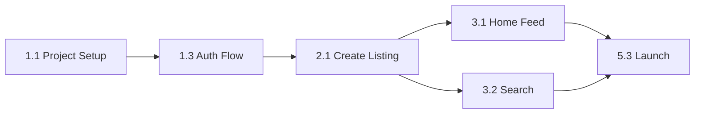

# UniVerse - Implementation Roadmap

**Created:** January 20, 2026  
**Timeline:** 6-8 Weeks  
**Goal:** Production-ready MVP with zero-cost infrastructure

---

## Overview

```
Epic (Big Goal)
└── Milestone (Deliverable)
    └── Task (Atomic Work Unit)
```

---

## Epic 1: Foundation & Authentication 🔐
**Duration:** Week 1-2 | **Priority:** Critical

### Milestone 1.1: Project Setup
| # | Task | Effort | Dependencies |
|---|------|--------|--------------|
| 1.1.1 | Initialize Next.js 15 + TypeScript + Tailwind | 2h | - |
| 1.1.2 | Configure Firebase project (Auth, Firestore) + Supabase Storage | 1h | - |
| 1.1.3 | Setup Algolia index + API keys | 30m | - |
| 1.1.4 | Configure Vercel deployment | 30m | 1.1.1 |
| 1.1.5 | Create `.env.local.template` with all variables | 15m | 1.1.2, 1.1.3 |
| 1.1.6 | Deploy Firestore rules + indexes | 30m | 1.1.2 |
| 1.1.7 | Configure Supabase Storage bucket + RLS | 15m | 1.1.2 |

**Deliverable:** Running Next.js app with Firebase/Algolia connected

---

### Milestone 1.2: Student Data Import
| # | Task | Effort | Dependencies |
|---|------|--------|--------------|
| 1.2.1 | Create `import-students.ts` script | 1h | 1.1.2 |
| 1.2.2 | Validate CSV format (academicId, fullName) | 30m | 1.2.1 |
| 1.2.3 | Import initial students.csv | 15m | 1.2.2 |
| 1.2.4 | Verify import in Firestore Console | 15m | 1.2.3 |

**Deliverable:** `students` collection populated

---

### Milestone 1.3: Authentication Flow
| # | Task | Effort | Dependencies |
|---|------|--------|--------------|
| 1.3.1 | Implement `firebase/client.ts` (Client SDK) | 30m | 1.1.2 |
| 1.3.2 | Implement `firebase/admin.ts` (Admin SDK) | 30m | 1.1.2 |
| 1.3.3 | Create `/login` page with Google button | 2h | 1.3.1 |
| 1.3.4 | Create `/register` page with academic ID form | 3h | 1.3.1 |
| 1.3.5 | Implement `verifyAndRegisterStudent` Server Action | 2h | 1.3.2, 1.2.3 |
| 1.3.6 | Implement session cookie creation | 1h | 1.3.5 |
| 1.3.7 | Implement `getServerSession()` helper | 1h | 1.3.6 |
| 1.3.8 | Create middleware for protected routes | 1h | 1.3.7 |
| 1.3.9 | Implement `logoutUser` Server Action | 30m | 1.3.6 |
| 1.3.10 | E2E test: Full registration flow | 1h | 1.3.1-1.3.9 |

**Deliverable:** Users can register with Google + Academic ID, login, logout

---

## Epic 2: Core Listings 📋
**Duration:** Week 3-4 | **Priority:** Critical

### Milestone 2.1: Create Listing
| # | Task | Effort | Dependencies |
|---|------|--------|--------------|
| 2.1.1 | Define TypeScript types (`Listing`, `User`) | 30m | - |
| 2.1.2 | Create listing form component (type, title, desc, price) | 3h | 2.1.1 |
| 2.1.3 | Implement image upload (Server Action → Supabase) | 3h | 1.3.1 |
| 2.1.4 | Implement phone number prompt (first listing only) | 1h | 2.1.2 |
| 2.1.5 | Implement `createListing` Server Action | 2h | 1.3.7 |
| 2.1.6 | Implement Algolia sync on create | 1h | 2.1.5, 1.1.3 |
| 2.1.7 | Create `/listing/new` page | 2h | 2.1.2-2.1.6 |
| 2.1.8 | E2E test: Create listing with images | 1h | 2.1.7 |

**Deliverable:** Users can create listings with images

---

### Milestone 2.2: View Listing
| # | Task | Effort | Dependencies |
|---|------|--------|--------------|
| 2.2.1 | Create listing detail component | 3h | 2.1.1 |
| 2.2.2 | Create image gallery component | 2h | - |
| 2.2.3 | Create contact buttons (WhatsApp/Call) | 1h | - |
| 2.2.4 | Implement partial academicId display (`20**0001`) | 30m | - |
| 2.2.5 | Create `/listing/[id]` page | 2h | 2.2.1-2.2.4 |

**Deliverable:** Users can view listing details with contact options

---

### Milestone 2.3: Edit & Delete Listing
| # | Task | Effort | Dependencies |
|---|------|--------|--------------|
| 2.3.1 | Implement `updateListing` Server Action | 2h | 2.1.5 |
| 2.3.2 | Create `/listing/[id]/edit` page | 3h | 2.1.2, 2.3.1 |
| 2.3.3 | Handle image add/remove in edit | 2h | 2.3.2 |
| 2.3.4 | Implement `deleteListing` Server Action (soft delete) | 1h | 1.3.7 |
| 2.3.5 | Add delete confirmation modal | 1h | 2.3.4 |
| 2.3.6 | E2E test: Edit and delete flows | 1h | 2.3.1-2.3.5 |

**Deliverable:** Users can edit/delete their own listings

---

### Milestone 2.4: My Listings (Profile)
| # | Task | Effort | Dependencies |
|---|------|--------|--------------|
| 2.4.1 | Create `/profile` page | 2h | 1.3.7 |
| 2.4.2 | Query user's listings (Client SDK) | 1h | 2.4.1 |
| 2.4.3 | Display listing cards with edit/delete buttons | 2h | 2.4.2 |
| 2.4.4 | Show deleted listings (greyed out) | 1h | 2.4.3 |

**Deliverable:** Users can manage their listings from profile

---

## Epic 3: Search & Discovery 🔍
**Duration:** Week 5-6 | **Priority:** Critical

### Milestone 3.1: Home Feed
| # | Task | Effort | Dependencies |
|---|------|--------|--------------|
| 3.1.1 | Create listing card component | 2h | - |
| 3.1.2 | Implement Algolia search client | 1h | 1.1.3 |
| 3.1.3 | Create home page with listings grid | 2h | 3.1.1, 3.1.2 |
| 3.1.4 | Implement infinite scroll | 2h | 3.1.3 |
| 3.1.5 | Add skeleton loaders | 1h | 3.1.3 |

**Deliverable:** Home page shows latest listings with infinite scroll

---

### Milestone 3.2: Search & Filter
| # | Task | Effort | Dependencies |
|---|------|--------|--------------|
| 3.2.1 | Create search bar component | 1h | - |
| 3.2.2 | Implement Algolia InstantSearch | 2h | 3.1.2 |
| 3.2.3 | Create filter chips (All/Products/Services) | 1h | - |
| 3.2.4 | Implement filter with Algolia facets | 2h | 3.2.3, 3.2.2 |
| 3.2.5 | Display empty state for no results | 30m | 3.2.2 |
| 3.2.6 | E2E test: Search and filter | 1h | 3.2.1-3.2.5 |

**Deliverable:** Full-text search with type filtering

---

## Epic 4: Trust & Safety 🛡️
**Duration:** Week 5-6 (parallel) | **Priority:** High

### Milestone 4.1: Reporting System
| # | Task | Effort | Dependencies |
|---|------|--------|--------------|
| 4.1.1 | Create report modal component | 2h | - |
| 4.1.2 | Implement `submitReport` Server Action | 1h | 1.3.7 |
| 4.1.3 | Implement auto-flag logic (3+ reports) | 1h | 4.1.2 |
| 4.1.4 | Remove flagged listing from Algolia | 30m | 4.1.3 |
| 4.1.5 | E2E test: Report flow + auto-flag | 1h | 4.1.1-4.1.4 |

**Deliverable:** Users can report listings, auto-flag at 3 reports

---

### Milestone 4.2: Admin Scripts
| # | Task | Effort | Dependencies |
|---|------|--------|--------------|
| 4.2.1 | Create `algolia-retry-sync.ts` | 1h | 2.1.6 |
| 4.2.2 | Create `cleanup-deleted-listings.ts` | 1h | 2.3.4 |
| 4.2.3 | Create `cleanup-orphaned-images.ts` | 1h | 2.1.3 |
| 4.2.4 | Test scripts with --dry-run | 30m | 4.2.1-4.2.3 |

**Deliverable:** Admin maintenance scripts ready

---

## Epic 5: Polish & Launch 🚀
**Duration:** Week 7-8 | **Priority:** High

### Milestone 5.1: Static Pages
| # | Task | Effort | Dependencies |
|---|------|--------|--------------|
| 5.1.1 | Create `/about` page | 1h | - |
| 5.1.2 | Create `/privacy` page | 2h | - |
| 5.1.3 | Create `/terms` page | 2h | - |
| 5.1.4 | Add navigation links | 30m | 5.1.1-5.1.3 |

---

### Milestone 5.2: UI Polish
| # | Task | Effort | Dependencies |
|---|------|--------|--------------|
| 5.2.1 | Mobile responsiveness audit | 2h | All UI |
| 5.2.2 | Loading states (spinners, skeletons) | 2h | - |
| 5.2.3 | Error states and toasts | 2h | - |
| 5.2.4 | RTL (Arabic) styling fixes | 2h | - |
| 5.2.5 | Create 404 and error pages | 1h | - |

---

### Milestone 5.3: Pre-Launch
| # | Task | Effort | Dependencies |
|---|------|--------|--------------|
| 5.3.1 | Security rules testing | 2h | All rules |
| 5.3.2 | Performance audit (Lighthouse) | 1h | All pages |
| 5.3.3 | Beta testing with real users | 4h | All features |
| 5.3.4 | Fix beta feedback issues | 4h | 5.3.3 |
| 5.3.5 | Final students.csv import | 30m | 5.3.4 |
| 5.3.6 | Production deployment | 1h | 5.3.5 |

**Deliverable:** 🎉 MVP Live!

---

## Summary

| Epic | Milestones | Tasks | Duration |
|------|------------|-------|----------|
| 1. Foundation & Auth | 3 | 21 | Week 1-2 |
| 2. Core Listings | 4 | 24 | Week 3-4 |
| 3. Search & Discovery | 2 | 11 | Week 5-6 |
| 4. Trust & Safety | 2 | 9 | Week 5-6 |
| 5. Polish & Launch | 3 | 15 | Week 7-8 |
| **Total** | **14** | **80** | **6-8 Weeks** |

---

## Critical Path



Key dependencies that block everything else:
1. **Firebase setup** → All backend features
2. **Auth flow** → All protected features
3. **Create listing** → Search, Edit, Delete
4. **Algolia integration** → Home feed, Search

---

## Recommended Weekly Cadence

| Week | Focus | End Goal |
|------|-------|----------|
| 1 | Setup + Auth basics | Google login working |
| 2 | Auth complete + Students import | Full registration flow |
| 3 | Create + View listing | Users can post listings |
| 4 | Edit/Delete + Profile | Full listing lifecycle |
| 5 | Home feed + Search | Discovery working |
| 6 | Reports + Filters | Trust features done |
| 7 | Polish + Static pages | Feature complete |
| 8 | Testing + Launch | 🚀 MVP Live |

---

## Related Documents

- [PRD.md](./PRD.md) - Product requirements
- [ARCHITECTURE.md](./ARCHITECTURE.md) - Technical details
- [DEVELOPMENT.md](./DEVELOPMENT.md) - Dev setup
